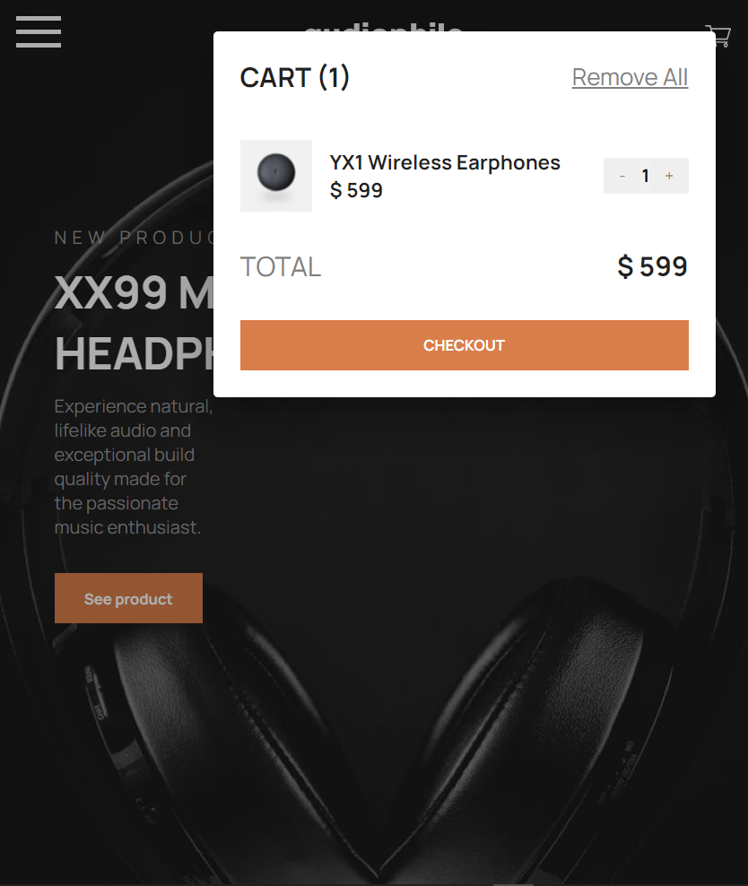
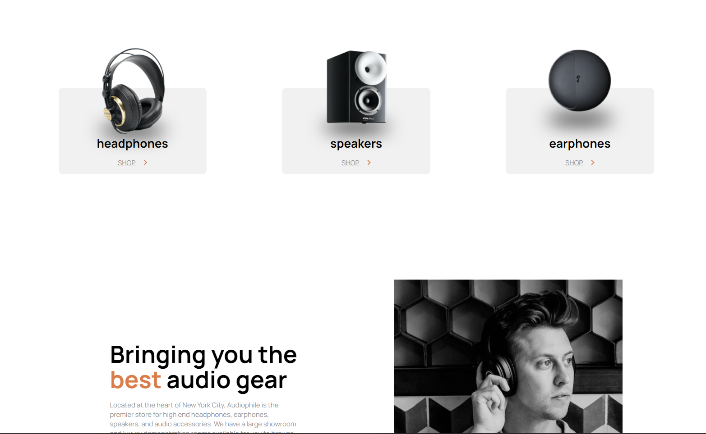
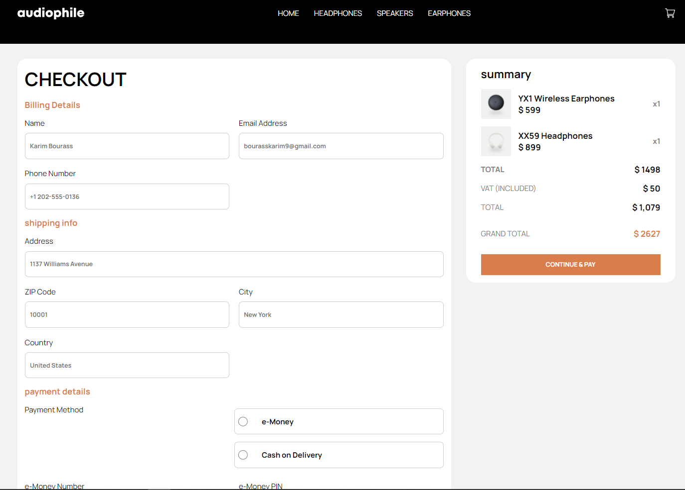
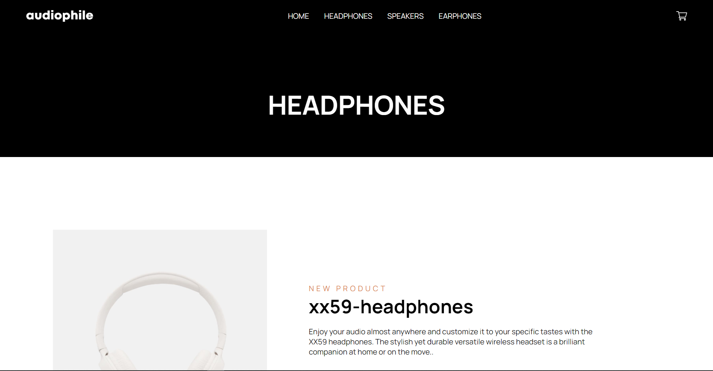

## Welcome! 👋

In this repo you can find my solutions to the Frontendmentor challenges.

## The challenges :computer:

# Quickstart

## 1. Clone the projet & install dependencies

```bash
  git clone https://github.com/KarimBourass/audiophile
  npm install
```

## 2. Serve the project

```bash
  ng serve
```

# From the app
 &nbsp;
 &nbsp;
 &nbsp;

